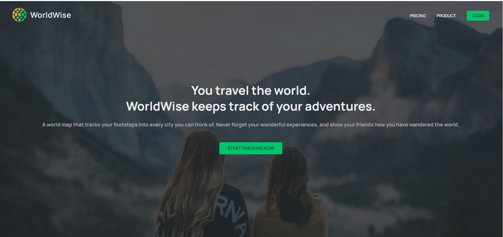
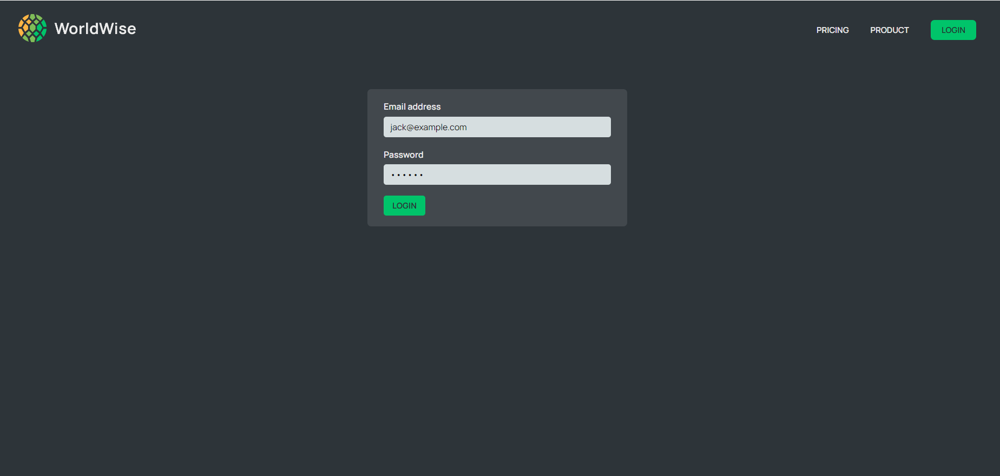
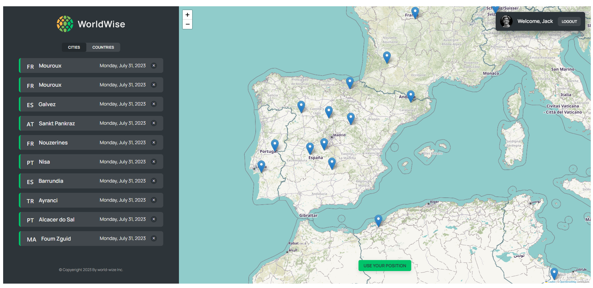
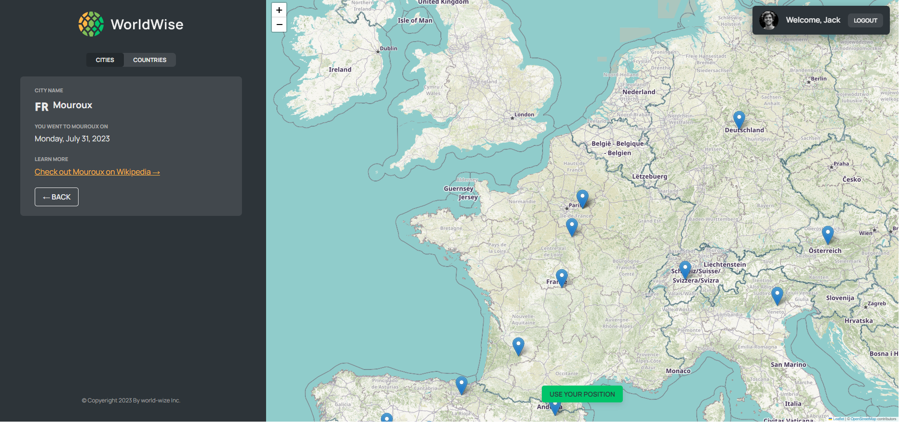
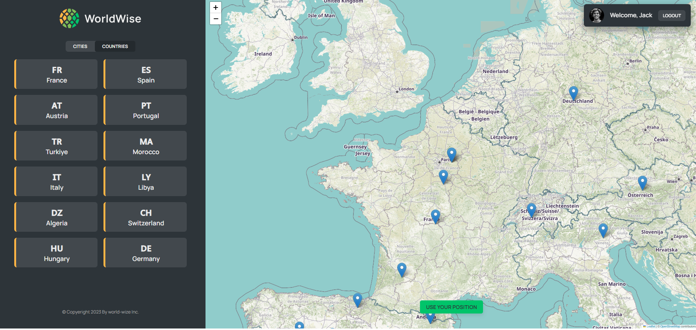
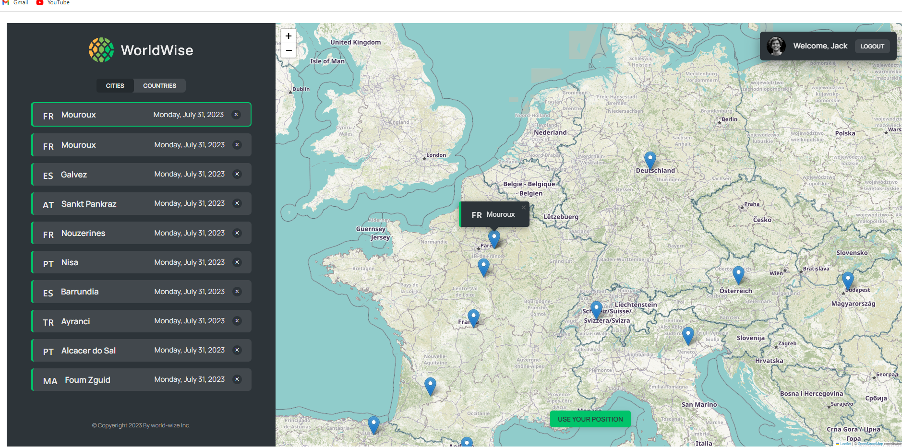

# World-Wise-App.

The World-Wise-App is a Single Page Application (SPA) built with React, React Router, React Redux, CSS Modules, Context API, and custom hooks. It allows authenticated users to explore and keep track of their travel journeys by adding cities to their personalized lists. Each city entry includes essential details like the city name, visit date, and notes about the journey.

## Features.

User Authentication: The app includes a user authentication system to ensure data privacy and personalized experiences.

Interactive Map: Authenticated users can access an interactive map that displays the cities they've visited.

Add and Delete Cities: Users can easily add new cities to their list, complete with visit date and journey notes. They can also remove cities if needed.

## installation.

1-Clone the repository to your local machine.
https://github.com/Mohamed-Ramadan1/World-Wise-App.git
* on the terminal.
2-npm install

3-npm run server

4-npm run dev

## APP-preview.

